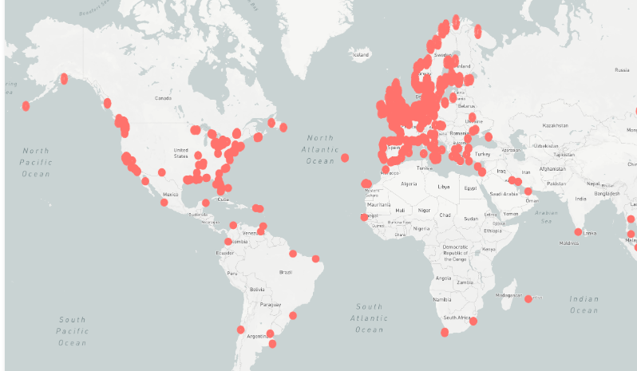

**Vessel Locator**

1. Vessel Locator API
    - VesselFinder API does not have a standard "1000 requests/day" free tier for its direct API. Fetching data is paid. 
    - Free Tier is of embedded map widgets (basically the iframe)
    - As of now using *aisstream.io*
    - **Drawbacks**
      - Does not cover a lot of regions

***Notes***

- *When going prod*: 
    - Instead of streaming data 24/7 (which burns credits), you design your backend to be "lazy":
    - Don't Poll Everything: Do not ask for "All ships in Mumbai" every 30 seconds.
    - On-Demand Polling: Only fetch data when a user is actually looking at the map.
    - Caching:
        Scenario: User A opens the map of Mumbai. You pay 1 credit to fetch ships.
        Optimization: Save that data in your database (Redis/PostgreSQL) for 2 minutes.
        Scenario: User B opens the map 10 seconds later. Do not call the API. Serve them the data from User A.
        Result: You serve 1,000 users but only pay for 1 API call every 2 minutes.

Endpoint: 
Sample Res: 
{
  "type": "FeatureCollection",
  "features": [
    {
      "type": "Feature",
      "properties": {
        "mmsi": 244012012,
        "speed": 6.3,
        "course": 157.7,
        "lat": 51.69773333333333,
        "lon": 4.610203333333333,
        "last_updated": "2025-11-27T17:07:51.656962+00:00"
      },
      "geometry": {
        "type": "Point",
        "coordinates": [
          4.610203333333333,
          51.69773333333333
        ]
      }
    },
    {
      "type": "Feature",
      "properties": {
        "mmsi": 211559990,
        "speed": 0,
        "course": 359,
        "lat": 53.52193666666667,
        "lon": 9.931466666666667,
        "last_updated": "2025-11-27T17:07:51.659452+00:00"
      },
      "geometry": {
        "type": "Point",
        "coordinates": [
          9.931466666666667,
          53.52193666666667
        ]
      }
    },
  ]
}